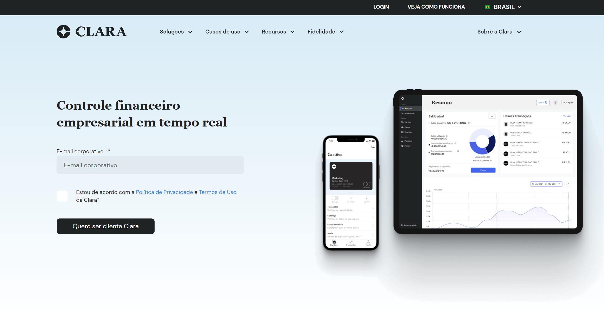

# Automation Challenge by Clara
> Automation technical challenge with JavaScript, [Cypress](https://www.cypress.io/) and [Cucumber](https://github.com/badeball/cypress-cucumber-preprocessor)



### Steps ✨

- Access the website clara.cc
- Select Mexico language
- Validate url

---

### Setup ⚙️

- Git\
Default Installation
- NodeJS\
Default Installation (LTS)
- Dependencies

```bash
    npm install
```

---

### How to run ⚡

- Run all tests

```bash
    npm test
```

- Open Cypress Dashboard

```bash
    npm cy:open
```

---
### Reports 📂

At the end of the execution, the test evidence will be generated in the folder `videos`